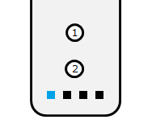

# ESP32Wiimote

ESP32Wiimote is an Arduino library for ESP32 boards that connects to a Wii Remote (Wiimote) over Bluetooth Classic, with optional Nunchuk support.

Due to ESP32 Bluetooth Classic HCI limitations, this project supports one active Wiimote connection per ESP32 radio.

## Features

- ✅ Button input (A/B/C/Z/1/2/Minus/Home/Plus/D-Pad)
- ✅ Wiimote accelerometer data
- ✅ Nunchuk accelerometer and analog stick data
- ✅ Connection state check via `isConnected()`
- ✅ Single-controller operation (1 Wiimote per ESP32 radio, due to Bluetooth Classic HCI limits)
- ✅ Battery level readout (0-100%) via `getBatteryLevel()`
- ✅ Battery status requests via `requestBatteryUpdate()`
- ✅ Serial runtime control (`wm ...`) with deterministic responses
- ✅ Credential-validated unlock window for privileged serial commands
- ✅ Runtime credentials model shared by Serial and Wi-Fi auth
- ✅ Wi-Fi REST control API with Bearer/Basic auth
- ✅ Runtime Wi-Fi station credentials (SSID/password) with async join lifecycle
- ✅ Optional command queue status polling endpoint (`/api/commands/<id>/status`)
- ✅ Optional split WebSocket event streams with sequence-based recovery
- ✅ Static OpenAPI 3.0 document at `/openapi.json`
- ✅ Comprehensive 4-level logging system (ERROR/WARN/INFO/DEBUG)
- ✅ Unit tests with PlatformIO
- ✅ Hardware integration tests

## Documentation

- 📖 **[API Reference](docs/API.md)** - Complete API documentation with examples
- 🔧 **[Testing Guide](docs/TESTING.md)** - Run unit tests and integration tests
- 📊 **[Logging System](docs/LOGGING.md)** - Configure debug output (4 levels)
- 🏗️ **[Architecture](docs/ARCHITECTURE.md)** - System design and data flow
- 🗺️ **[Roadmap](docs/ROADMAP.md)** - Delivery plan and control-surface scope
- 🔍 **[Troubleshooting](docs/TROUBLESHOOTING.md)** - Common issues and solutions

Canonical behavior documentation is maintained under `docs/`.
Files under `plans/` are working execution notes and are not the source of truth.

## Requirements

- ESP32 board (any)
- Arduino CLI `>= 1.4.1`
- ESP32 core package: `esp32:esp32@3.3.7`
- Wii Remote (RVL-CNT-01)
- Wii Nunchuk (optional)

## Installation

1. Download this repository as a `.zip`.
2. In Arduino IDE, go to `Sketch > Include Library > Add .ZIP Library...`.
3. Select the downloaded `.zip` file.

## Quick Start

```cpp
#include "ESP32Wiimote.h"

ESP32Wiimote wiimote;

void setup() {
    Serial.begin(115200);
    wiimote.init();
}

void loop() {
    wiimote.task();  // Must be called regularly
    
    // Check for new data
    if (wiimote.available()) {
        ButtonState btn = wiimote.getButtonState();
        
        if ((btn & ButtonA) != 0) {
            Serial.println("A button pressed!");
        }
        
        // Read sensors
        AccelState accel = wiimote.getAccelState();
        Serial.printf("Accel: %d, %d, %d\n", 
            accel.xAxis, accel.yAxis, accel.zAxis);
    }
}
```

For complete examples, see [API Reference](docs/API.md).

## Examples

Focused examples:

- [BasicConnection](./examples/BasicConnection/BasicConnection.ino) - connect and print connection state changes
- [ButtonInput](./examples/ButtonInput/ButtonInput.ino) - button mask and basic button handling
- [SensorReadout](./examples/SensorReadout/SensorReadout.ino) - Wiimote/Nunchuk accelerometer and stick output
- [BatteryStatus](./examples/BatteryStatus/BatteryStatus.ino) - periodic battery status requests and reporting
- [FiltersDemo](./examples/FiltersDemo/FiltersDemo.ino) - apply data filters to reduce update volume
- [WifiControlLifecycle](./examples/WifiControlLifecycle/WifiControlLifecycle.ino) - runtime Wi-Fi/auth config, async lifecycle state, REST/WebSocket delivery mode

Comprehensive example (all features):

- [AllFeaturesDemo](./examples/AllFeaturesDemo/AllFeaturesDemo.ino)

## Usage

No manual Bluetooth pairing is required.

Connection model note: due to Bluetooth Classic HCI limitations, this library is designed for a single Wiimote connected to one ESP32 radio at a time.

1. Press `1 + 2` on the Wii Remote.
2. LED1 turns on when the connection is established.



## Connection Test

Use `isConnected()` to check connection status at runtime.

```cpp
#include "ESP32Wiimote.h"

ESP32Wiimote wiimote;

void setup() {
  Serial.begin(115200);
  wiimote.init();
}

void loop() {
  wiimote.task();

  if (wiimote.isConnected()) {
    Serial.println("Wiimote connected");
  } else {
    Serial.println("Wiimote disconnected");
  }

  delay(1000);
}
```

For less serial spam, print only on state change:

```cpp
static bool wasConnected = false;

void loop() {
  wiimote.task();
  bool connected = wiimote.isConnected();

  if (connected != wasConnected) {
    Serial.println(connected ? "CONNECTED" : "DISCONNECTED");
    wasConnected = connected;
  }
}
```

## Battery Level

Use `getBatteryLevel()` to read the Wiimote battery level (percentage).

```cpp
uint8_t battery = wiimote.getBatteryLevel();
Serial.printf("Battery: %d%%\n", battery);
```

**Manual Updates:**

Request a battery status refresh:

```cpp
wiimote.requestBatteryUpdate();  // Async - check after delay
delay(100);
uint8_t battery = wiimote.getBatteryLevel();
```

**Auto-Update:**

Battery level is automatically requested when the Wiimote first connects.

**Notes:**

- Returns 0-100 (percentage)
- Updated from Wiimote status reports (0x20)
- `requestBatteryUpdate()` only works when connected

See [API Reference](docs/API.md#battery-management) for details.

## Filters

You can reduce update volume by ignoring selected categories:

```cpp
wiimote.addFilter(FilterAction::Ignore, FilterAccel);
wiimote.addFilter(FilterAction::Ignore, FilterNunchukStick);
wiimote.addFilter(FilterAction::Ignore, FilterButton);
```

Available filters:

- `FilterAccel`
- `FilterNunchukStick`
- `FilterButton`

See [API Reference](docs/API.md#filtering) for details.

## Serial Control

The serial control path is line-oriented and handled inside `ESP32Wiimote::task()`.

Protocol basics:

- command prefix: `wm`
- one command per line
- response prefix: `@wm:`
- one complete serial line processed per `task()` call

Example session:

```text
wm status
@wm: ok

wm unlock admin password 30
@wm: ok

wm led 0x01
@wm: ok
```

Privileged commands are locked by default and return `@wm: error locked` until an unlock window is active.

When credentials are configured, invalid unlock credentials return `@wm: error bad_credentials`.

### Runtime Wi-Fi/Auth Configuration

Configure runtime auth credentials and Wi-Fi policy before startup:

```cpp
WiimoteConfig runtimeConfig = {
  true,
  {"admin", "password", "esp32wiimote_bearer_token_v1"},
  {"YOUR_WIFI_SSID", "YOUR_WIFI_PASSWORD"}
};

ESP32Wiimote wiimote;
wiimote.configure(runtimeConfig);
wiimote.enableWifiControl(true, WifiDeliveryMode::RestAndWebSocket);
```

See [API Reference](docs/API.md#serial-control-interface) for command details.

### Wi-Fi REST + Event Streams

When Wi-Fi control is enabled and ready, you can use:

- REST snapshots:
  - `GET /api/wiimote/status`
  - `GET /api/wiimote/config`
- command queue status:
  - `GET /api/commands/<id>/status`
- optional split event streams (when delivery mode is `RestAndWebSocket`):
  - `GET /api/wiimote/input/events`
  - `GET /api/wiimote/status/events`

WebSocket event messages include `seq`, `event`, and `payload` fields.
Use `seq` as a cursor for reconnect/replay handling and fallback to REST snapshots if a gap is detected.

## Testing

ESP32Wiimote includes comprehensive unit tests and integration tests.

### Build Script (Recommended)

Use the root build script for all common tasks:

```bash
./build.sh help
```

Common targets:

```bash
./build.sh test:native
./build.sh test:coverage
./build.sh test:dev
./build.sh test:dev:build
./build.sh release
```

Set serial port for hardware targets:

```bash
ESP32_PORT=/dev/ttyUSB0 ./build.sh test:dev
ESP32_PORT=/dev/ttyUSB0 ./build.sh upload:dev
```

### Run Native Tests (No Hardware)

```bash
./build.sh test:native
```

Fast unit tests run on your PC in ~1.5 seconds. No ESP32 required!

### Run Integration Tests (ESP32 + Wiimote)

```bash
ESP32_PORT=/dev/ttyUSB0 ./build.sh test:dev
```

Hardware tests with a real Wiimote.

### Coverage Reports

```bash
./build.sh test:coverage
```

Coverage outputs are written under `coverage/`:

- `coverage/gcovr-summary.txt`
- `coverage/gcovr.xml`
- `coverage/html-gcovr/index.html`
- `coverage/lcov.info`
- `coverage/html-lcov/index.html`

See [Testing Guide](docs/TESTING.md) for complete instructions.

### Run GitHub Workflows Locally (act)

To catch CI/release issues before pushing, run the repository workflows locally with [act](https://github.com/nektos/act):

```bash
./scripts/run-workflows-local.sh help
```

Common commands:

```bash
# Run PlatformIO CI workflow
./scripts/run-workflows-local.sh ci

# Simulate pull_request event for CI
./scripts/run-workflows-local.sh ci --event pull_request --branch develop

# Run the local-safe release workflow
# This validates the tag and builds the demo, but skips GitHub release publishing steps
./scripts/run-workflows-local.sh release

# Run a specific release job
./scripts/run-workflows-local.sh release --job validate-tag-version --tag 1.5.0

# Allow the original publishing workflow when you explicitly want it
GITHUB_TOKEN=ghp_xxx ./scripts/run-workflows-local.sh release --allow-publish --tag 1.5.0
```

You can pass extra act options after `--`, for example:

```bash
./scripts/run-workflows-local.sh ci -- --pull=false
```

## Troubleshooting

### Connection Issues

**Wiimote won't connect?**

- Press and hold 1 + 2 buttons simultaneously
- Wait for LEDs to blink
- Keep ESP32 within 5 meters

**Battery shows 0%?**

- Call `wiimote.requestBatteryUpdate()` after connection
- Battery updates asynchronously - check after 100ms

**Buttons not responding?**

- Always check `wiimote.available()` before reading data
- Make sure `wiimote.task()` is called in `loop()`

See [Troubleshooting Guide](docs/TROUBLESHOOTING.md) for more solutions.

## Logging

Control debug output by defining `WIIMOTE_VERBOSE` before including the library:

```cpp
#define WIIMOTE_VERBOSE 2

#include "ESP32Wiimote.h"
```

You can also set it from PlatformIO:

```ini
build_flags = -DWIIMOTE_VERBOSE=2
```

If you do not define it, the library defaults to:

```cpp
#define WIIMOTE_VERBOSE 2  // 0=Errors, 1=+Warnings, 2=+Info, 3=+Debug
```

**Log Levels:**

- **0**: Errors only (production)
- **1**: + Warnings
- **2**: + Info messages (default - shows connection events)
- **3**: + Debug traces (packet dumps, detailed flow)

See [Logging System](docs/LOGGING.md) for complete documentation.

## Contributing

Contributions are welcome! Whether it's bug fixes, new features, or documentation improvements.

### Quick Start for Contributors

1. Fork and clone the repository
2. Run tests: `pio test -e native`
3. Make your changes
4. Add tests for new features
5. Submit a pull request

See [Contributing Guide](docs/CONTRIBUTING.md) for detailed instructions on:

- Development setup
- Code organization
- Coding standards
- Testing requirements
- Pull request process

## License

See [LICENSE.md](./LICENSE.md).
